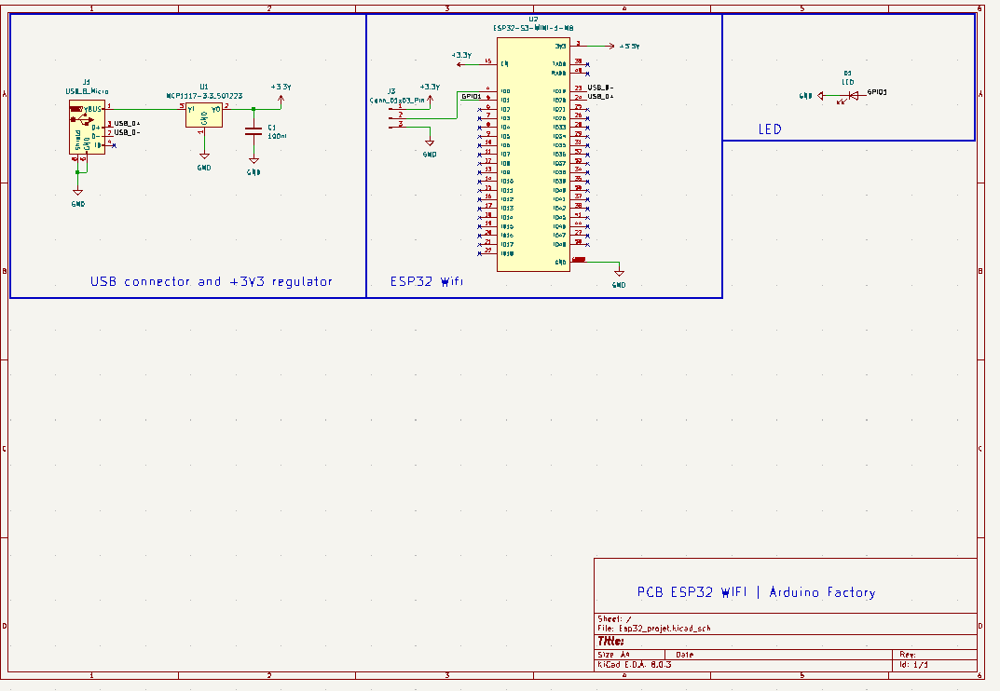
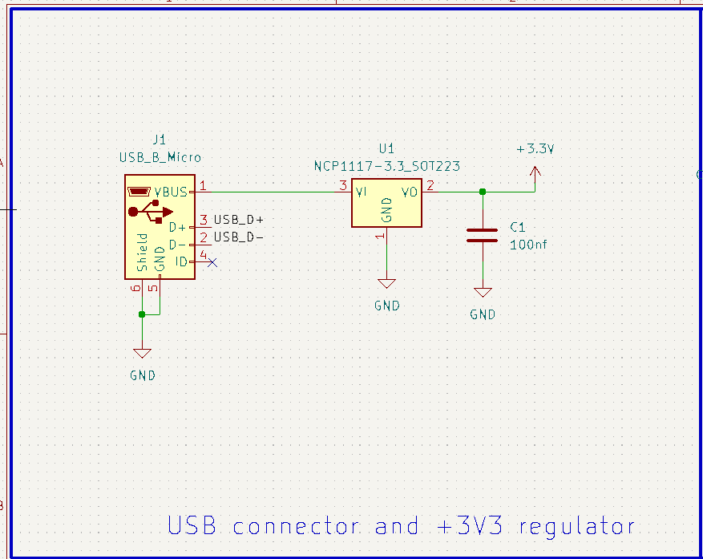
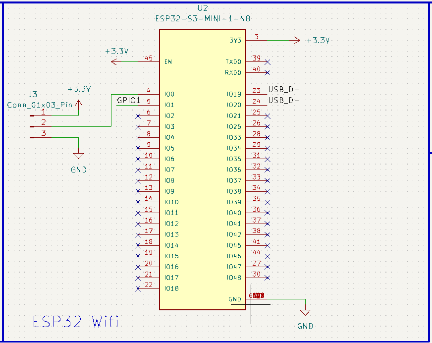
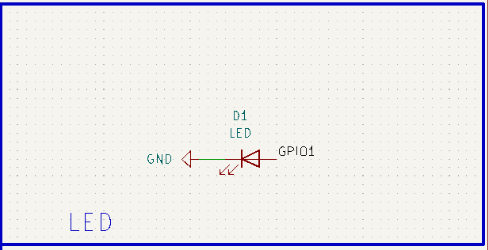
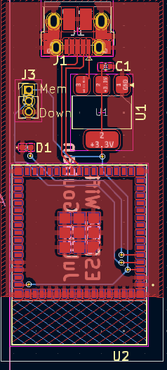
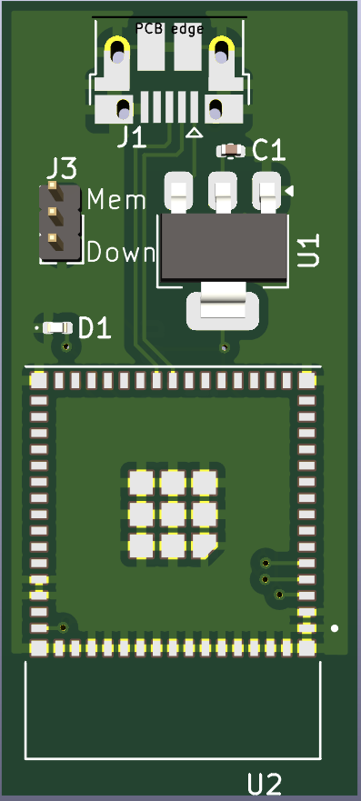

# ESP32-WIFI-PCB-BOARD

The ESP32 is a microcontroller produced by Espressif Systems, a Chinese company specializing in wireless connectivity solutions. The ESP32 is the successor to the ESP8266, another popular microcontroller.

The ESP32 integrates advanced functionalities, including Wi-Fi and Bluetooth connectivity, making it suitable for a wide range of IoT applications. We've created a simple PCB based on the ESP32 Wifi microcontroller on Kidcad.

*Project duration: 3 days*

# Table of contents
- [Electronic diagram](#electronic-diagram)
- [PCB Design](#pcb-design)
  

## Electronic diagram

We'll now take a closer look at how our electronic board works:

 

To power our ESP32 Wi-Fi card, we've integrated a type B micro-USB connector, facilitating both program upload and card powering.

We've also added a +3.3V voltage regulator, as the ESP32 can't handle a 5V supply:

 

The ESP32 is supplied with +3.3V via the voltage regulator.

We've also integrated a 3-pin male connector for flash memory programming or program start-up:
 

An LED is connected to GPIO 1, allowing the GPIO pins on the ESP32 board to be tested by flashing the LED :
 

## PCB Design

The board is designed in two layers. On the top, we find the 3.3V voltage regulator and the Micro-USB type B connector. A ground plane has been added to the entire board, with the exception of the area around the Wi-Fi antenna at the bottom.

A ground plane (or a large metal surface) can interfere with the electromagnetic field generated by the antenna. The antenna is designed to transmit or receive radio waves (in the Wi-Fi frequency range, generally around 2.4 GHz or 5 GHz), and a ground plane under the antenna can interfere with the propagation of these waves by modifying the distribution of the electric or magnetic field around the antenna.

The design was carried out using KiCad, and manufacturing was entrusted to JLCPCB, at a cost of around fifteen euros.

 

Here is a 3d view of the PCB:
 

Here is a 3d view of the PCB:

  

